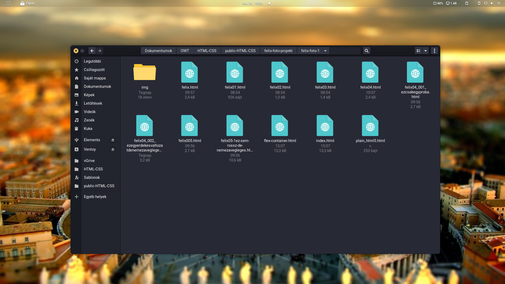

# **Üdv! Kedves Petra!**

Igen, ezzel a fájllal itt már azt próbálgatom, hogy majd a githubon, hogy fogok kommunikálni a fejlesztőkkel, akik esetleg forkolják majd a fájljaimat..

Na hogy ne legyünk ennyire önhittek, és hurrá optimisták, elmondom, mit találsz a "felix-foto-1"-mappában:

- az img folder-ben találod a képeket, melyeket az oldal használ
- a HTML fájok tartalmazzák a próbálkozásaimat.

A próbálkozásaim első látásra lólépés szerűnek tűnhetnek, de be kell vallanom, hogy anno(a 20001s elején) tanultam plain HTML-t, ezért az alap dolgok már nem annyira idegenek tőlem. Viszont most újra kell tanulnom, mert a VScode rendszeresen figyelmeztet, no meg a validator is, hogy amilyen formázást szeretnék használni, az sajnos már "idejétmúlt"..
:-D Amint azt olvashatod, több szálon futnak itten a dolgok, mert közben elkezdtem már a gitet is tanulmányozni.
Linux felhasználóként évek óta van git repóm, mert gondoltam, hátha jó lesz valamire, ha másra nem is, akkor a saját "dotfájlokat" menedzselni vele..
Így ha újrahúztam a rendszert, legalábbmár egy Openbox újra konfigolással nem kellett szenvednem. No nem mintha manapság nem lenne rá valami GUI-tool, de jobb szeretem inkább magam megírni a konfigfájlokat, ha csak nem egy nagy asztali környezetről beszélünk.. Az Openboxban hála az égnek csak pár xml-fájlt meg egy shell scriptet kell módosítgatni.

***

## **No de vissza a lényeghez:**

- Elsőnek kezdtem egy sima HTML5 dokumentummal, ahogyan a leckében is volt.

- Aztán, mivel a leckében megemlítettétek, hogy bátran tanuljak a w3schools oldalán, én így tettem.

- A plain HTML megoldást aztán hamar el is vetettem, ahogy rátaláltam a flex-container layoutra a Layout tutorialok közt

### **Innen már egyenes út vezetett a jelenlegi állapothoz**

A képeket az unsplash-ről szedtem le, nem egy ember produktuma. De "összehoztam", hogy jó legyen, egyforma színhőmérsékletet (vagy inkább annak hiányát :-D ) adtam a képeknek..
Jó lenne ha ez a srác készítene magáról egy olyan képet is, ahol törökülésben ül, mert már van erre ötletem (kivágnám a háttérből és körbefuttatnám őt szöveggel, de itt még nem tart a CSS vagy VueJS vagy akármi tudományom, de nem baj, mert majd ti megtanítjátok :-D )

Közben létrehoztam egy [public-HTML-CSS]() git repót, hogy könnyebben közzétehessem a leckék anyagait, mármint azokat, amelyekre azt mondjátok, hogy nem baj, ha bárki számára elérhető. Mivel nincs gitPro előfizetésem, ezért csak úgy lehet nem publikus repóm, ha előfizetek rá. Ha ez a megoldás nem jó, akkor a leckék anyagainak a közlését tovább folytatom a gdrive-omon, de úgy gondolom, hogy a git kezelésének elsajátítása egy nagyon **hasznos és jövőbe mutató** pazarlása volt a drága leckeidőnek.. :-D

