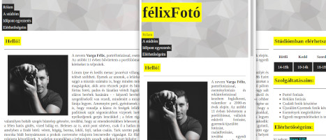
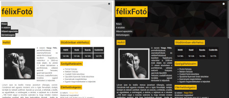
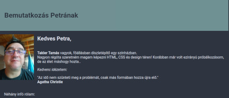

# **A mappa tartalma:**

Ez itt a public-HTML-CSS mappa, vagy könyvtár, Itt kapnak helyet a megoldott feladataim, továbbá
egyéb OWT-vel kapcsolatos ötlet, "szösszenet", vagy akármi.

# **Félix weboldalának változatai**

**első változat, egy oldalas HTML**

**második változat, external CSS+"dark mode"**

# **HTML-1 feladat: A bemutatkozó oldalam**

# **HTML-2 feladatok**

