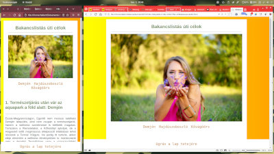

# **A mappa tartalma:**

Ez itt a public-HTML-CSS mappa, vagy könyvtár, Itt kapnak helyet a megoldott feladataim, továbbá
egyéb OWT-vel kapcsolatos ötlet, "szösszenet", vagy akármi.
A képekre kattintva, a hozzá tartozó feladat könyvtárába lépsz.
***

# **Félix weboldalának változatai**

**első változat, egy oldalas HTML**

**második változat, external CSS+"dark mode"**

***

# **HTML-1 feladat: A bemutatkozó oldalam**

***

# **HTML-2 feladatok**

***

# **HTML-3 feladatok**

**bemutatkozó oldal egyszerűsítve, de külső stíluslappal**

**mákos guba recept, internal/inline/external-css**

**falfestés stílus gyakorlat**

**hibakeresés, lakberendezés stílushibák**

**Félix oldalának második változata, external CSS+"dark mode"**
 a HTML-3 feladatsor részeként

**A Bootstrap leckék első része, egy lapozó, zöldségekkel és a "töréspontos" képernyőképek**
 A screenshots mappában találhatók a képernyőképek a devtoolban megnyitott "container-fluid", vagy "container" osztályú div elemek töréspontjain készült képernyőfotókkal.

# **HTML-4 feladatok**

**A Mordor Paintball weboldala, a HTML-4 lecke tárolóelemes része**
 A feladat során átalakítottam az oldalt, kipróbáltam több, számomra érdekes/és/vagy látványos megoldást:
- mostanában újra divat a skeumorph/neomorph stílus, ezért kipróbáltam az "opálüveg" effektet CSS-ben
sajnos a Firefox egyelőre nem támogatja ezt a megoldást (backround-blur), ezért ott belőttem helyette egy háttérszínt átlátszósággal.

**taklert.design - azaz, a bemutatkozó oldalam**
 A saját weboldalam kezdeti design és kód tervezete. Amit még meg szeretnék valósítani:
- a "hero" képet le fogom cserélni png-ről svg-re, hogy kódból tudjam színezni scriptelni, majd ha már tanulok egy kis JS-t, jQuery-t, VueJS-t, akármit..
  persze gondolkozom egy igazi Linux-neckbeard megoldáson is: bash scriptből módosítani a színsémát a szerveren napszaknak megfelelően.. de ez még a távoli jövő :-D

**Hibajavítás a HTML-4 lecke részeként..(kicsit ezt is átszabtam, de csak kicsit :-D**
 A hibajavítós feladat..

